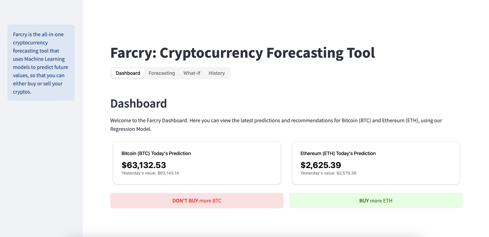

# Farcry: Cryptocurrency Forecasting Tool


[**Documentation**](https://inteli.gitbook.io/farcry-cryptocurrency-forecasting-tool)

## What is Farcry?

**Farcry** is a cryptocurrency forecasting tool designed to help users make informed decisions when buying or selling Bitcoin (BTC) and Ethereum (ETH). It combines Machine Learning models for forecasting, an intuitive user interface, and a robust backend for seamless data handling. With Farcry, users can:

- **View Latest Predictions** for Bitcoin and Ethereum prices.
- **Receive Buy/Sell Recommendations** based on predicted price movements.
- **Visualize Historical and Forecasted Data** to understand cryptocurrency trends.
- **Access System Logs** for transparency on backend activities.

## Models

Farcry uses two types of Machine Learning models:

1. **Regression Models**: Predicts the next closing price for BTC and ETH, providing immediate "BUY" or "DON'T BUY" recommendations.
2. **Time Series Models**: Uses ARIMA and Prophet to forecast future cryptocurrency values based on historical trends, allowing users to see where the market might be heading.

## Backend

- **Stack**: The backend is built with **FastAPI**, a modern, fast (high-performance) web framework for Python that handles data processing and API requests.
- **Database**: **Supabase**, an open-source alternative to Firebase, is used for data storage, providing a PostgreSQL-based backend with integrated authentication and file storage.
- **Endpoints**:
  - `/predictRegression`: Provides predictions for BTC and ETH for the current day.
  - `/predictTimeSeries`: Fetches both historical and future forecast data for cryptocurrencies.
  - `/logs`: Retrieves system logs to provide transparency and monitoring capabilities.

## Frontend

- **Streamlit**: The frontend is created with **Streamlit**, which provides an easy-to-use web interface for visualizing predictions and recommendations.
- **Key Features**:
  - **Dashboard**: Displays up-to-date cryptocurrency predictions and user-friendly "BUY" or "DON'T BUY" recommendations.
  - **Forecasting Charts**: Interactive graphs show historical and forecasted values for BTC and ETH.
  - **History Tab**: Provides logs of system activities for monitoring.

## Docker

Farcry uses Docker to containerize both the backend and frontend, making deployment easy and efficient:

- **Backend**: Runs on **port 8000** using a Docker container with **FastAPI**.
- **Frontend**: Runs on **port 8501** using **Streamlit**.
- **Docker Compose**: The services are managed via a `docker-compose.yml` file, ensuring consistent deployment across different environments.

## How to Run Farcry

1. **Clone the Repository**:
   ```bash
   git clone https://github.com/your-username/farcry.git
   cd farcry
   ```
2.	**Build and Start Services**:
    Use Docker Compose to build and start both the backend and frontend services.
    ```bash
    docker-compose up --build
    ```
3.	**Access Farcry**:
	* **Frontend (Streamlit App)**: Open http://localhost:8501 in your web browser to interact with the Farcry interface.
    * **Backend API**: The API can be accessed at http://localhost:8000.

## Documentation

For detailed information about Farcry, including installation, functionality descriptions, and more, please refer to the [official documentation](https://inteli.gitbook.io/farcry-cryptocurrency-forecasting-tool).

